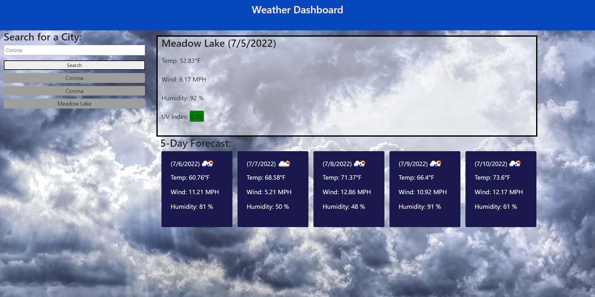

# Weather-Dashboard

This browser-based application was made to provide the current weather of any city you input, as well as a look at the five day forecast ahead. A few key elements are the stored past searches as well as the ability to click on those past searched cities and get the updated weather report for them, in addition to the weather icons located throughout the page to give the user an idea of what they would see in the sky on that given day. This project actually forced me to get used to a tool I hadn't had much real experience with so far. Before I get into that, I'll just let you know I experienced some heavy weather getting one looking how it should.

## Riders On The Storm

The tool I had to really get familiar with was Bootstrap. Despite having brief experiences with it before, for this project the entire layout of the page was made with bootstraps grid/column layout tools which for me was a bit of a challenge. I had a fair bit of trouble getting things looking how they should, mainly stemming from the dreaded columns and containers and rows of bootstrap as well as my hesitation to stick to mainly divs as opposed to semantic based elements. However, eventually I was riding that storm easy with a much better grasp on how it all worked together which allowed to get things moving much more quickly. After that, the actual coding and programming came easy.

## Links

[The Website](https://jguerrero126.github.io/Weather-Dashboard/)

[The Respository](https://github.com/JGuerrero126/Weather-Dashboard)

## Images/Screenshots

